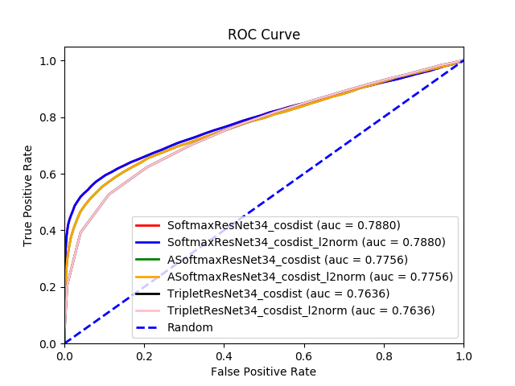

# AMMAI HW1 APD FACE VERIFICATION

# Step 0. Installation

#### Testing Environment: Python 3.5.2

#### Install Dependencies

~~~~
pip install requirements.txt
~~~~

# Step 1. Obtain Dataset: [CASIA WebFace](https://drive.google.com/file/d/1wJC2aPA4AC0rI-tAL2BFs2M8vfcpX-w6/view?usp=sharing)

## unzip CASIA-WebFace clean version with following commands:

~~~~
unzip casia-maxpy-clean.zip
cd casia-maxpy-clean
zip -F CASIA-maxpy-clean.zip --out CASIA-maxpy-clean_fix.zip
unzip CASIA-maxpy-clean_fix.zip
~~~~

## To obtain APD Dataset. Please see the homework slide.

# Step 2. Align face based on the five keypoints and resize images to 224 * 224

## Obtain [face alignment tools](https://github.com/ZhaoJ9014/face.evoLVe.PyTorch)

~~~~
# Trainset Alignment
git clone https://github.com/ZhaoJ9014/face.evoLVe.PyTorch.git
cd face.evoLVe.PyTorch/align
python face_align.py -source_root '/media/iis/ssdx16/CASIA-maxpy-clean' -dest_root '/media/iis/ssdx16/CASIA-maxpy-clean-aligned' -crop_size 224

# APD Dataset Alignment
# Step 1. Change file structures of your raw data to fit alignment tool requirement.
python A2A_.py # Input the folder named "A" and output the folder named "A_"
# Step 2. Use alignment tools
cd face.evoLVe.PyTorch/align
python face_align.py -source_root '/media/iis/ssdx16/A_' -dest_root '/media/iis/ssdx16/A-aligned' -crop_size 224
# Step 3. Change file structures of your aligned data to fit homework format
cd ../..
python A-aligned2C.py # Input the folder named "A-aligned" and output the folder named "C_224"

# LFW Dataset Alignment (the raw data can be download via this link: "http://vis-www.cs.umass.edu/lfw/lfw.tgz")
tar -xvf lfw.tgz
cd face.evoLVe.PyTorch/align
python face_align.py -source_root '/media/iis/ssdx16/lfw' -dest_root '/media/iis/ssdx16/lfw-aligned' -crop_size 224
~~~~

# Step 3. Train

### Before training, you should check the training set named "CASIA-maxpy-clean-aligned" and the testing set named "C" (or "C_224") exists. Then, run the following scripts: 

~~~~
bash train.sh
~~~~

# Step 4. Test

### Before running the scripts, please download the pretrained checkpoints via this [link](https://drive.google.com/open?id=1LeHlcT9Okxp3LmkJSmLCcjVge-e2QWm6)

~~~~
bash test.sh
~~~~

# Experiments

## APD 256 x 256

|               |  ResNet-18 with l2 dist.    |  ResNet-34 with l2 dist.  |
|---------------|:---------------------------:|--------------------------:|
| Softmax-only  |  |  |
| ASoftmax(m=3) |    |  |
| Triplet Loss  |  |  |

|               |  ResNet-18 with cosine dist.    |  ResNet-34 with cosine dist.  |
|---------------|:-------------------------------:|------------------------------:|
| Softmax-only  |  |  |
| ASoftmax(m=3) |    |  |
| Triplet Loss  |  |  |

## APD 224 x 224

|               |  ResNet-18 with l2 dist.    |  ResNet-34 with l2 dist.  |
|---------------|:---------------------------:|--------------------------:|
| Softmax-only  |  |  |
| ASoftmax(m=3) |    |  |
| Triplet Loss  |  |  |

|               |  ResNet-18 with cosine dist.    |  ResNet-34 with cosine dist.  |
|---------------|:-------------------------------:|------------------------------:|
| Softmax-only  |  |  |
| ASoftmax(m=3) |    |  |
| Triplet Loss  |  |  |

## LFW 224 x 224

|               |  ResNet-18 with l2 dist.    |  ResNet-34 with l2 dist.  |
|---------------|:---------------------------:|--------------------------:|
| Softmax-only  |  |  |
| ASoftmax(m=3) |    |  |
| Triplet Loss  |  |  |

|               |  ResNet-18 with cosine dist.    |  ResNet-34 with cosine dist.  |
|---------------|:-------------------------------:|------------------------------:|
| Softmax-only  |  |  |
| ASoftmax(m=3) |    |  |
| Triplet Loss  |  |  |